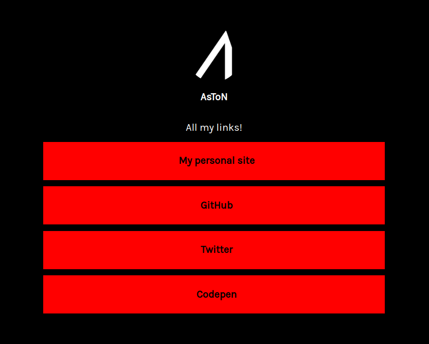

<h1 align="center">
  Linkbowl 🥣
   
  
   
</h1>

Create links for your social media!

<a href="https://linkbowl.aston.dev">Live Link</a>

## Overview

## Links

Add, Remove, Disable and Drag your links!

## Themes

Pick a theme that suits you the most!

## Built with

* [Next.js](https://nextjs.org/)
* [Strapi](https://strapi.io/)
* [Chakra UI](https://chakra-ui.com/)
* [React DND](https://github.com/react-dnd/react-dnd)